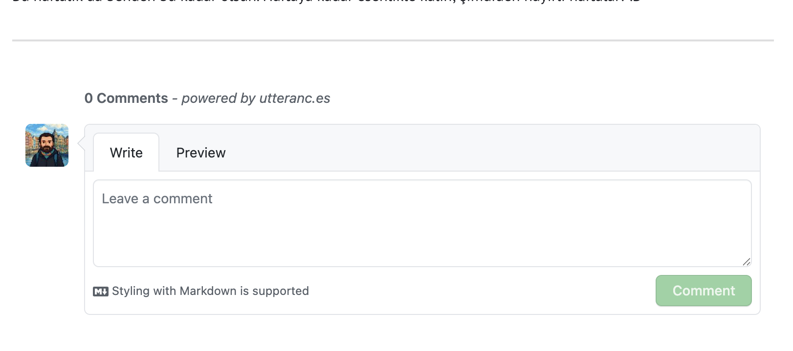

Selamlar, bu yazıda "github page'ime yorum sistemi nasıl eklerim?", "disqus mu kullansam?" gibi sorularını kişişel blog'u içib github page kullanan birisinin Utterances ile nasıl issuelara comment atabileceğinizi  dilim döndüğünce anlatacağım haydi başlayalım,




## Utterances nedir?

Şimdi düşünün, blogunuza biri yorum yapmak istiyor ama siz Disqus gibi ağır, reklamlı sistemler kullanmak istemiyorsunuz. İşte tam burada Utterances devreye giriyor. GitHub Issues altyapısını kullanıyor yani her blog yazınız için otomatik bir issue açılıyor ve yorumlar oraya düşüyor. Hem ücretsiz hem de GitHub hesabı olan herkes yorum yapabiliyor, spam da neredeyse sıfır çünkü GitHub hesabı lazım.

Peki neden bunu kullanalım?

Bir kere cebinden para çıkmıyor, tamamen açık kaynak. Disqus gibi her yere reklam sıkıştıran bir sistem değil, tertemiz duruyor sayfanda. Script'in kendisi 3KB falan, yani sayfanı yavaşlatmıyor hiç. Bir de yorumlarda Markdown yazabiliyorsun, kod paylaşmak isteyen biri için süper bir özellik bu. Zaten hedef kitlen yazılımcılarsa GitHub hesapları var, ekstra bir yere kayıt olmalarına gerek kalmıyor.


## Nasıl kurulur?

### 1. Uygulamayı yükle

[github.com/apps/utterances](https://github.com/apps/utterances) adresine git, "Install" de ve blogunun repo'sunu seçerek kurabiliriz. 

### 2. Repo public olmalı

Ha bu önemli, repo'n public olmalı. GitHub Pages kullanıyorsan zaten public şekilde çalışan repolar.

### 3. github pageler için 

Jekyll kullanıyorsan `_layouts/post.html` dosyana şunu ekle:

```html
<script src="https://utteranc.es/client.js"
        repo="kullanici-adi/repo-adi"
        issue-term="pathname"
        theme="github-light"
        crossorigin="anonymous"
        async>
</script>
```

### 4. Config'e ekle (daha düzenli olsun istersen)

`_config.yml` dosyana şunları ekleyebilirsin:

```yaml
comments:
  utterances:
    repo: "kullanici-adi/repo-adi"
    issue_term: "pathname"
    theme: "github-light"
```

Sonra layout'ta şöyle kullanırsın:

```liquid


  <script src="https://utteranc.es/client.js"
          repo="{{ site.comments.utterances.repo }}"
          issue-term="{{ site.comments.utterances.issue_term }}"
          theme="{{ site.comments.utterances.theme }}"
          crossorigin="anonymous"
          async>
  </script>


```


## Tema seçenekleri

Birkaç tema var seçebilirsin:

- `github-light` - açık tema, klasik
- `github-dark` - koyu tema, gece kuşları için
- `preferred-color-scheme` - sistem temasına göre otomatik geçiş yapar

Daha fazlası da var ama bunlar en çok kullanılanlar.


## Alternatif: Giscus

GitHub Discussions kullanmak istersen [Giscus](https://giscus.app) de var. Aynı mantık ama Issues yerine Discussions kullanıyor. Kurulumu da benzer.


## Özet

Utterances ile yorum sistemi kurmak çok basit, ücretsiz, reklamsız ve GitHub ekosistemiyle uyumlu. Okuyucuların zaten GitHub hesabı varsa ekstra bir şey yapmadan yorum yapabilirler.

Bu blogda da artık Utterances var, aşağıdan ilk yorumu sen yap! :D

---
