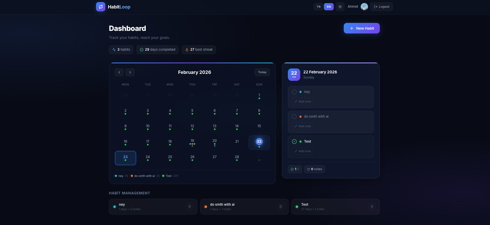
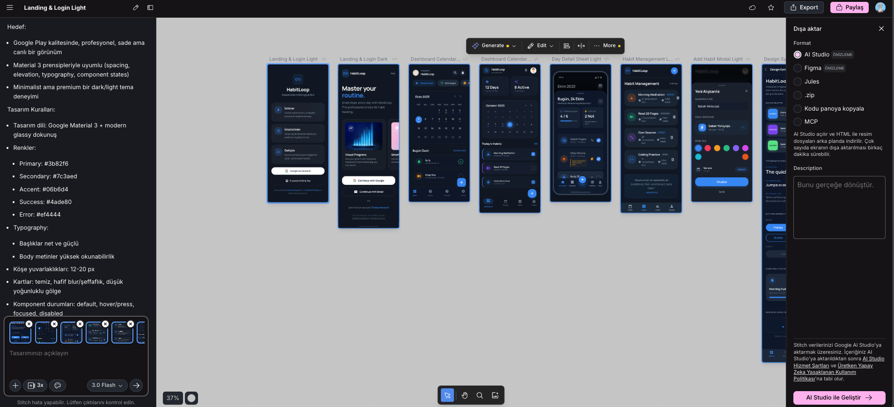

Hafta 8'den selamlar,

Umarım her şey yolundadır, iyisinizdir. Bu hafta diğer haftalardan farklı olarak daha çok elimden geldiğince AI üzerine farklı alanlarda yazılar okumaya çalıştım. İlgimi çeken yazılar ve GitHub repoları aşağıda belirtiyor olacağım. Bunlar dışında ufak bir AI ile side projesi denemeleri yapıyordum, burada doğrudan son kullanıcıya değil genelde kendim için bir şeyler yapıyordum.

Bu hafta Claude Sonnet 4.6 kullanarak küçük bir alışkanlık takip uygulaması [Habit Loop](https://habit-loop-rho.vercel.app/)'ı yaptım ve Vercel üzerinde yayınladım. Süreçte prompt’ları Gemini ile hazırladıktan sonra, yazdı kral benim için (evet, token’ların birazcık içinden geçiyor).

Burada asıl soru şu: "Her çıkan ve maliyeti fazla olan model daha mı iyi?"

[I Tested Sonnet 4.6 vs Opus 4.6 for Vibe Coding]( https://medium.com/@dan_43009/i-tested-sonnet-4-6-vs-opus-4-6-for-vibe-coding-heres-the-winner-4165870c8a3a ) gibi pek çok platformda benzer kıyaslamalar mevcut. Benim kişisel deneyimime göre; Sonnet şu an çok pratik olsa da, Opus 4.6 kodlama konusunda yeni gelecek modellerin öncüsü olacak diye düşünüyorum.

Bu uygulamanın düzgün çalıştığını gördükten sonra aslında önceden görüp ufak bir şeyler denediğim Google'ın UI/UX geliştirmek için çıkardığı Stitch'i deneyimlemek için bu uygulamanın mobil uygulamasının UI tasarımları için https://stitch.withgoogle.com/ üzerinden düzgün açıklayıcı şekilde verdiğim prompt ile çok da güzel şekilde mobil uygulama çıktısını verdi. Burada pek çok ortama output alabiliyoruz. Denemelerime devam edip tecrübelerimi aktarıyor olacağım. 

Kısa kısaa;

- [fastlane](https://fastlane.tools/), Android ve iOS uygulamalarının dağıtım sürecini basitleştirmeyi amaçlayan açık kaynaklı bir platformdur.

- [vercel-labs / portless](https://github.com/vercel-labs/portless): Geliştirme aşamasında localhost port numaraları yerine anlamlı ve sabit .localhost URL'leri kullanmanızı sağlayan araç.

- [shadcn-ui / taxonomy](https://github.com/shadcn-ui/taxonomy): Radix UI ve Tailwind CSS kullanılarak oluşturulan, modern bir uygulamanın sahip olması gereken tüm mimariyi (Auth, Dashboard, Subscriptions) içeren örnek uygulama.

- [x1xhlol / system-prompts](https://github.com/x1xhlol/system-prompts-and-models-of-ai-tools)Popüler AI araçlarının (Cursor, Claude Code, v0 vb.) arkasındaki sistem prompt'larını ve modellerini listeleyen devasa bir arşiv.

Bu haftalık da benden bu kadar olsun. Haftaya kadar esenlikle kalın; şimdiden hayırlı haftalar! :D
